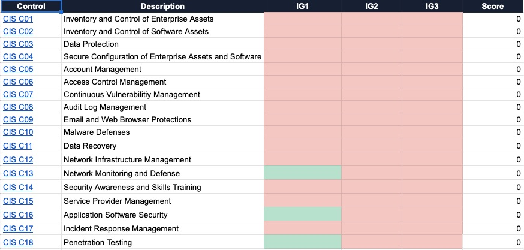

# CISv8 Heatmap

The CISv8 Heatmap is a template created to calculate the level of maturity for  Center for Internet Security (CIS) Critical Security Controls. 
The spreadsheet has a few nuances. 

## Applicable
In each control there is an applicable boolean. If this is set to false the score will be set to 1 when calculating the maturity as the control isn't applicable. 

## Scoring
The scoring sheet tab has the values for each drop-down to calculate the value or the score. The summary tab uses the scoring ranges from CIS mapping the level of maturity to the security program. 

